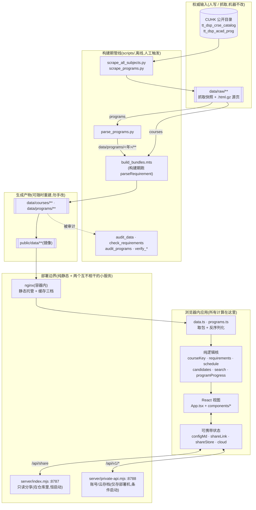

# Architecture — CU Schedule

> 从代码推导(2026-08-10)。与代码冲突时以代码为准,并回来修本文。
> 机器门只校验 [interfaces.md](interfaces.md);本文与 [structure.md](structure.md) 靠人读。



## 一句话

**一个没有后端的静态站点**:课程与培养方案数据在构建期离线烤成不可变 JSON,排课、冲突检测、
先修判定、学分统计**全部在每个用户自己的浏览器里跑**。服务端只有两个都不参与计算的小进程:
仓库内的只读分享(`server/index.mjs`,恒启动)与只存部署机的账号云存档(`private-api.mjs`,
有文件才启动)。这不是过渡形态,是有意的终态——它决定了下面每一条边界。

## 组件与职责

| 组件 | 拥有什么 | 明确不拥有什么 |
|---|---|---|
| **抓取层** `scripts/*scrape*.py`, `cuhk_scraper.py`, `data_utils.py` | 与 CUHK 页面对话、落 `data/raw/**` 快照(含 `.html.gz` 源页备查) | 不做语义解析;不判断数据对错 |
| **解析层** `scripts/parse_programs.py` | 把培养方案自由文本重建成 `structure` 树(编号/字母/散文各层、约束句、等价课) | 不碰课程目录;不写 `data/raw/**` |
| **打包层** `scripts/build_bundles.mts` | 把 raw 压成按学期的紧凑 wire 包,**并在构建期跑一次 `parseRequirement` 写进 `req`** | 不做 UI 关心的排序/筛选 |
| **审计层** `audit_data` · `check_requirements` · `audit_programs` · `verify_*` | 用真实数据把不变量钉死(零丢课、零学分谎报、先修零误报、预解析不分叉) | 不修数据;发现问题只报告 |
| **加载层** `src/lib/data.ts` · `programs.ts` | 取包、按版本号缓存、反序列化成 `Course`/`Program` | **零解析**——先修 AST 来自 wire |
| **纯逻辑核** `courseKey` · `requirements` · `schedule` · `candidates` · `search` · `programProgress` · `programChoose` · `overlap` | 身份判定、三值先修求值、排课回溯、候选分档、检索打分、学分归并 | 不碰 React、不碰 DOM、不碰 IO |
| **视图层** `App.tsx` + `src/components/*` | 状态编排、路由、拖拽、页面组装 | 不重新实现逻辑核的语义 |
| **可携带层** `configMd` · `shareLink` · `shareStore` · `cloud` | 用户状态的**出入通道**:`.md` 文件、`#s=`/`#st=` URL、只读分享、云存档 | 不定义状态本身(状态在 App) |
| **边界·静态** `deploy/nginx.conf` · `Dockerfile` | 托管 `dist/` + 缓存三档;`/api/v1/` 反代 8788、`/api/` 兜底反代 8787 | 不做任何计算 |
| **边界·分享** `server/index.mjs` | 只读分享存取(`POST /api/share`、`GET /api/share/:id`),内存 Map + 约 1 天 TTL。**随仓库分发、由 entrypoint 恒启动** | 不碰账号,不落盘 |
| **边界·账号** `server/private-api.mjs` | 账号与云存档(`/api/v1/*`),SQLite。**gitignore,仅存部署机**,entrypoint 见到文件才启动 | 对用户配置内容**零感知**(整包存取) |

## 数据流

**构建期(离线,人工触发,产物入库)**

```
CUHK 页面 → scrape_*.py → data/raw/**（权威快照，机器只读）
   ├─ 课程这半边：data/raw/courses/**  ──────────────┐
   └─ 方案这半边：data/raw/programs/**              │
         → parse_programs.py                        │   ← 串行，不是并行：
         → data/programs/<年>/<Faculty>/*.json ──────┤      build 读的是 parse 的产物
                                                     ↓
                                      build_bundles.mts
                       → data/courses/<年>/<term>.json + data/programs/programs.json
                       → 镜像 public/data/**（前端 fetch 的就是这份）
```

**运行时(浏览器)**

```
manifest.json（唯一 no-cache）→ generatedAt = dataVersion
   → 其余请求一律带 ?v=<dataVersion>（版本变则 URL 变，长缓存永远安全）
   → toCourse 零解析物化 Course
   → generatePlans / evaluateCandidates / computeProgramProgress …全在主线程同步跑
```

## 控制流(选课这条主链)

```
用户输入 → SearchFilters → searchCourses 打分排序（AND across tokens，上限 8/RENDER_CAP）
  → 加入 committed → generatePlans（回溯，MAX_COMBOS=240 / MAX_PLANS=48 双上限）
  → planViews（pin 过滤 / 删除过滤 / solo 回退，全部在 App.tsx 内联）
  → evaluateCandidates 对着「当前选中的那份课表」把每门课分成 open/rearrange/conflict/tba
  → TimetableCompare 渲染 A/B 两栏 + 冲突中点标记
```

## 边界与信任线

1. **静态数据线**:目录数据永远是静态文件,永远不为它建动态 API。计算留在客户端。
   越过这条线(比如"加个搜索接口")就会同时失掉 CDN 横向扩展、离线可用与零运维。
2. **权威输入线**:`data/raw/**` 是抓来的快照,**机器不许改**;`data/` 与 `public/data/` 是
   产物,随时可重建。任何"修数据"的冲动都应落在解析器上,不落在产物上。
3. **零解析线**:先修文本的解析只发生在构建期(`build_bundles.mts` 调用与客户端**同一份**
   `requirements.ts`),运行时只求值。审计层有一项专门证明两者不分叉。
4. **宁漏勿误线**:先修只在**可证明为否**时才报缺;学分只在**能对上课单**时才给进度条。
   工具不是权威,CUSIS 才是——UI 不得把不确定渲染成拦截性结论。
5. **服务端零感知线**:账号服务整包存取用户配置,不解析、不校验内容语义;它离线时应用
   除账号外一切照常,私有实现不随仓库分发。分享服务同理——只存取一份原始选课清单,由浏览器
   拿实时目录重新算出课表,所以分享出去的链接不会冻结成一张过期快照。
6. **AGPL-3.0 §13**:以网络服务提供本应用,界面必须保留源码入口(页脚 GitHub 链接)。

## 部署边界

- **产物即镜像**:两阶段 Dockerfile(node 构建 → nginx 托管 `dist/`),容器无状态、无数据库、
  无运行时写入。回滚 = 用旧 commit 重建。
- **缓存三档**(与 §数据流 的版本协议一一对应,勿单独改一处):
  `manifest.json` → no-cache(版本入口)· 其余 `/data/**` 与 `/assets/**` → 1 年 immutable
  (靠 `?v=` 与文件名哈希)· `index.html` → no-cache。
- **健康入口**打 `127.0.0.1/data/manifest.json`(不能写 `localhost`:镜像里它解析到 IPv6 而
  nginx 只监听 IPv4,探活会一直失败且反代会静默忽略不健康容器)。
- **上线不是 push**:本仓库 push 不触发部署。上线 = 部署机上 `docker compose up -d --build
  svc-cuschedule`。

## 已知的结构性张力(不是待办,是让下一个人别踩)

- **`App.tsx` 3145 行**承担了路由/历史、排课管线编排、拖拽系统、云同步状态机、整页 JSX 组装
  五件事,其中任何一件都够独立成模块。它是这套架构里唯一没有被逻辑核吸收的复杂度洼地。
- **可携带状态有四套各自手写的校验**(`sanitizeConfigState`、`decodeFromProse`、`decodeShare`、
  `decodeLiveState`)外加一条**完全没有校验**的通道(`loadShare` 直接信任服务端 JSON)。
  加一个用户状态字段,极易只改到其中一两处而在其余通道静默丢失。
- **取包有两条通道**:`data.ts` 管课程包,`programs.ts` 自己 fetch 方案包并复制了一份
  `?v=<dataVersion>` 拼法。缓存/版本协议因此有两个改动点,漏一个就会出现「课程包更新了、
  方案包还吃旧缓存」。
- **排课双上限会静默截断**:`MAX_COMBOS=240` 丢掉某门课的部分组合、`MAX_PLANS=48` 提前停止
  回溯。`evaluateCandidates` 的 `conflict` 判定建立在"所有已生成排法"之上,因此上限一旦咬住,
  一门其实排得进去的课可能被标成冲突。
