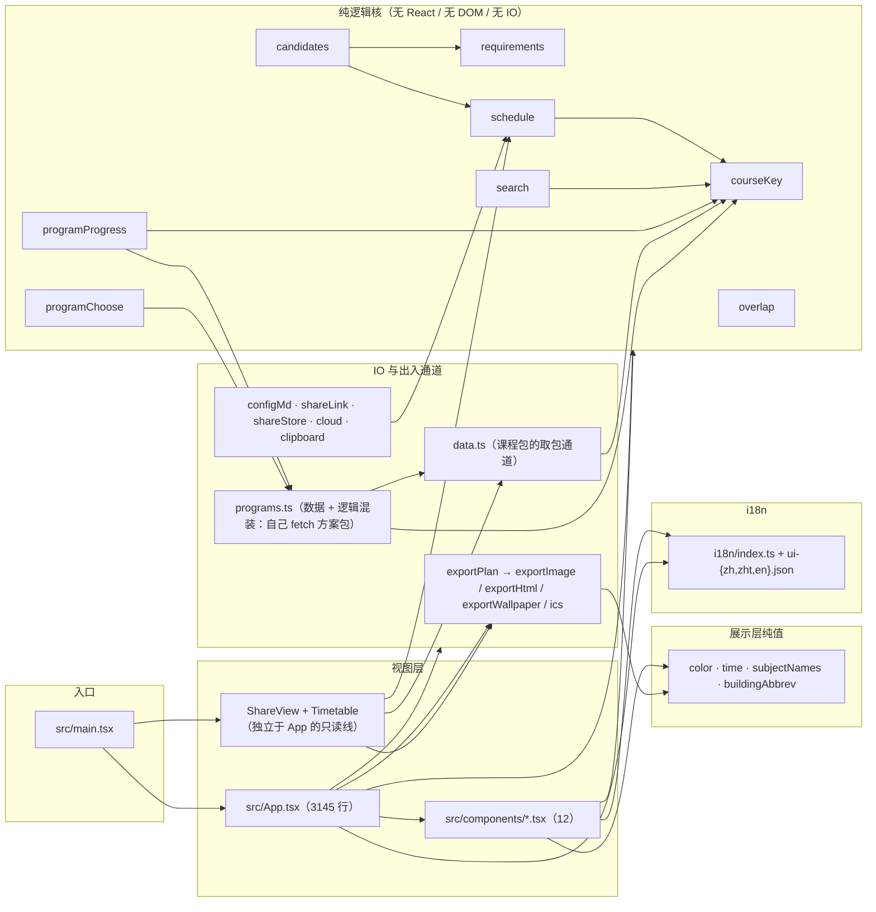

# Structure — CU Schedule

> 从代码推导(2026-08-10)。模块的**依赖方向**是这份文件真正要钉住的东西:
> 逻辑核不许向上依赖视图,视图不许绕过逻辑核自己重算。



**依赖方向铁律**:箭头只向下(视图 → 逻辑核 → 纯值)。逻辑核里任何一个模块 `import` 了
`react`、`document` 或 `fetch`,就是这条线被破了。

> **现状里已经有一处破线,如实记下来**:`programs.ts` 名字像纯逻辑,实际在 `loadPrograms()`
> 里**自己拼 URL 自己 `fetch`**(`src/lib/programs.ts:21,131`),没走 `data.ts`。所以
> 「`data.ts` 是唯一 fetch 通道」这句话**今天不成立**——方案包是第二条通道,它自己复制了一份
> `?v=<dataVersion>` 的拼法。要么把这次 fetch 收进 `data.ts`,要么就承认 `programs.ts` 属于
> IO 层(本图按后者画)。在收拢之前,**改缓存/版本协议必须同时改两处**。

## 模块表

### 入口与视图

| 模块 | 职责 | 依赖 |
|---|---|---|
| `src/main.tsx` | 唯一在 App 之外的路由决策:`#v=<id>` 走只读 `ShareView`,否则 `App` | `App` · `ShareView` · `shareStore` |
| `src/App.tsx` | 状态编排(61 个 useState)、URL/历史、排课管线编排、拖拽、云同步状态机、整页 JSX 组装 | 几乎所有 lib + 全部组件 |
| `src/components/SearchResults.tsx` | 选课结果流:分组、状态标记、渲染上限、拖拽起点;并**拥有 `SearchFilters` 类型**(App 消费) | `courseKey` · `color` · `time` |
| `src/components/CommittedList.tsx` | 已选/候选行,给了 `onPin` 才可交互;没给 `onRemove` 即只读 | `schedule` · `color` |
| `src/components/TimetableCompare.tsx` | A/B 双栏课表 + 可拖动作息参考线 + 冲突中点标记 + 候选幽灵块(配色由 `colorForCode` prop 注入,不自己取色) | `overlap` · `buildingAbbrev` · `time` |
| `src/components/Timetable.tsx` | 单张课表(无 A/B、无参考线),只被 `ShareView` 用 | `color` · `time` |
| `src/components/ProgramTable.tsx` | 培养方案大课表递归渲染 + 约束卡 | `programs` · `programChoose` · `color` |
| `src/components/ProgramProgress.tsx` | 学分进度纯展示(不做归并) | `programProgress` · `programs` |
| `src/components/ProgramPicker.tsx` · `SubjectPicker.tsx` · `CodeInput.tsx` | 三个 type-ahead 输入件 | `programs` / `data` / `search` |
| `src/components/CourseModal.tsx` | 课程详情弹层 | `programs` · `time` |
| `src/components/AppendixPage.tsx` | 静态附录页(校历链接 + 友站) | — |
| `src/components/ShareView.tsx` | `#v=<id>` 只读镜像,**不经过 App 的状态树**——代价是它自己取数据、自己排课,是 App 之外第二处直接调 `data` + `schedule` 的地方 | `shareStore` · `data` · `schedule` · `Timetable` · `exportPlan` · `color` · `courseKey` · `time` |

### 纯逻辑核

| 模块 | 职责 | 依赖 |
|---|---|---|
| `src/lib/courseKey.ts` | 课程身份:8 字符 key 即「同一门课」,后缀只用于显示 | — |
| `src/lib/requirements.ts` | 先修文本 → 布尔 AST;三值求值(只在可证明为否时报缺) | `courseKey` · `types` |
| `src/lib/schedule.ts` | section 组合 + 回溯排课;`MAX_COMBOS=240` / `MAX_PLANS=48` 双上限 | `types` |
| `src/lib/candidates.ts` | 把每门课对着当前排法分成 open / rearrange / conflict / tba | `schedule` · `requirements` |
| `src/lib/search.ts` | 课号解析 + 检索打分(跨 token 是 AND,任一不中即 0 分) | `courseKey` |
| `src/lib/programProgress.ts` | 学分按方案顶层节归并(等价组回退解析学分) | `programs` · `courseKey` |
| `src/lib/programChoose.ts` | 从方案节的英文散文判「N 选一 / 选满 N 学分」 | `programs` |
| `src/lib/overlap.ts` | 纯区间重叠中点扫描(给冲突标记定位) | — |

### IO 与出入通道

| 模块 | 职责 | 依赖 |
|---|---|---|
| `src/lib/data.ts` | 课程包的取包通道:manifest 定版本,其余一律带 `?v=`;`toCourse` 零解析 | `types` · `courseKey` |
| `src/lib/programs.ts` | 方案包加载(**自己 fetch**,只借 `data.ts` 的 `dataVersion`)+ type-ahead + 课号集合 + 必修/选修分类。数据与逻辑混装,见上文破线说明 | `data` · `courseKey` |
| `src/lib/configMd.ts` | `.md` 备份的编解码;`sanitizeConfigState` 是共享校验点 | `schedule`(Pins) |
| `src/lib/cloud.ts` | 云存档 HTTP 面 + 凭据存取;校验委托给 `sanitizeConfigState` | `configMd` |
| `src/lib/shareLink.ts` | `#s=`(一次性分享)与 `#st=`(实时书签)两条**互不合并**的 URL 通道 | `schedule`(Pins) |
| `src/lib/shareStore.ts` | 服务端只读分享的客户端(对 `server/index.mjs` :8787,约 1 天 TTL、内存不落盘) | — |
| `src/lib/clipboard.ts` | 剪贴板写入(异步 API + execCommand 兜底) | — |
| `src/lib/exportPlan.ts` | 导出总调度;分发到 image / pdf / html / wallpaper / ics | 四个导出实现 |

### 构建期管线

| 模块 | 职责 | 依赖 |
|---|---|---|
| `scripts/cuhk_scraper.py` | 课程目录抓取核心(vendored,AGPL-3.0) | `data_utils` |
| `scripts/scrape_all_subjects.py` | 全学科抓取 CLI(`npm run data:scrape`) | `cuhk_scraper` |
| `scripts/scrape_programs.py` | 培养方案抓取(含验证码) | `data_utils` |
| `scripts/parse_programs.py` | 方案自由文本 → `structure` 树 | — |
| `scripts/build_bundles.mts` | 打包 + **构建期跑 `parseRequirement`** + 镜像 public | `src/lib/requirements` · `courseKey` · `types` |
| `scripts/audit_data.mts` | 包 vs raw 对账 + 字段不变量 + **预解析不分叉证明** | 同上 |
| `scripts/check_requirements.mts` | 先修解析全目录零误报 | `src/lib/requirements` |
| `scripts/audit_programs.mts` | 方案 P1–P6 机器门(零丢课/零谎报/标题保真/19 回归 case) | `audit-whitelist.json` |
| `scripts/verify_catalog_parity.py` · `adjudicate_missing.py` · `verify_serper.py` | 三层核对:目录对账 → 逐门裁决 → 公网佐证 | `cuhk_scraper` |
| `scripts/i18n-extract.mjs` · `i18n-gen.mjs` | 源串提取(合并 `dynamic-zh.json`)+ 繁/英词典生成 | — |

> **管线的关键非对称**:`build_bundles.mts` 与三个审计脚本**直接 import 前端的
> `src/lib/requirements.ts`**——这是刻意的,保证构建期解析与运行时求值永远是同一份实现。
> 想给管线写一份"更快的"解析副本,就是在制造分叉。

## 数据目录

| 路径 | 性质 | 谁写 |
|---|---|---|
| `data/raw/courses/**` · `data/raw/programs/**` | **权威快照,机器只读** | 只有抓取脚本 |
| `scripts/audit-whitelist.json` | **人工裁决过的白名单**,每条带 reason | 只有人 |
| `src/i18n/dynamic-zh.json` | 手册:经变量到达 `t()` 的动态源串 | 只有人 |
| `data/programs/<年>/**` | 产物 | `parse_programs.py` |
| `data/courses/**` · `data/programs/programs.json` | 产物 | `build_bundles.mts` |
| `public/data/**` | 镜像 | `build_bundles.mts` |
| `src/i18n/ui-{zh,zht,en}.json` | 产物 | `i18n-extract` / `i18n-gen` |
| `src/fonts/redHatMonoInline.ts` | 产物 | `gen-font-inline.mjs` |

## 给「长期自动修改」的两条硬路径

**刷新课程目录**

```bash
npm run data:scrape && npm run data:build && npm run data:audit && npm run data:check
```

**刷新培养方案**

```bash
uv run python scripts/scrape_programs.py           # 可选,只在方案页更新时
python scripts/parse_programs.py
npm run data:build
npm run data:audit-programs                        # 必须 pass:true —— 它不在 CI 里
npm run data:audit && npm run data:check
```

提交前:`npx tsc -b` · `npm test` · `npm run build` · `data:check` · `data:audit` 全绿
(CI 强制这五项);**`data:audit-programs` 不在 CI**,动了解析器或方案数据必须手动跑。
上线是**部署机上**的 `docker compose up -d --build svc-cuschedule`,push 不触发。

审计出的 WARN 若是真缺陷就修,**不许塞进 `audit-whitelist.json`**——那个白名单只收
「参考提取器自身误报」。
